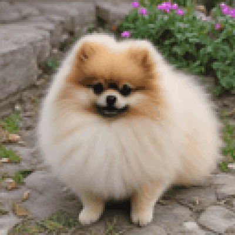

# obamify CLI

Revolutionary morphing animation technology - now as a headless CLI for generating GIF animations



## Features

-   Headless GPU rendering with wgpu (Vulkan backend)
-   Built-in presets: wisetree, blackhole, cat, cat2, colorful
-   Auto mode: transform any image using genetic algorithm
-   Docker support with development/production modes

## Usage

### Docker (Recommended)

**Development mode** (default):

```bash
# Preset mode
docker compose run --rm obamify-cli --preset wisetree --output output/test.gif

# Auto mode (transform to Obama)
docker compose run --rm obamify-cli --input image.png --auto --output output/result.gif

# Custom target
docker compose run --rm obamify-cli --input source.png --target target.png --output output/result.gif
```

**Production mode**:

```bash
# Edit .env: BUILD_MODE=production
docker compose build
docker compose run --rm obamify-cli --preset wisetree --output output/test.gif
```

### Parameters

-   `--resolution`: Render resolution (default: 2048)
-   `--output-resolution`: Output GIF size (default: 400)
-   `--gif-delay`: Frame delay in centiseconds (default: 8 = 12.5 FPS)
-   `--max-frames`: Frame count (default: 140)
-   `--sim-speed`: Speed multiplier (default: 1.5)
-   `--dst-force`: Transformation strength (default: 0.14)

## How it works

magic
